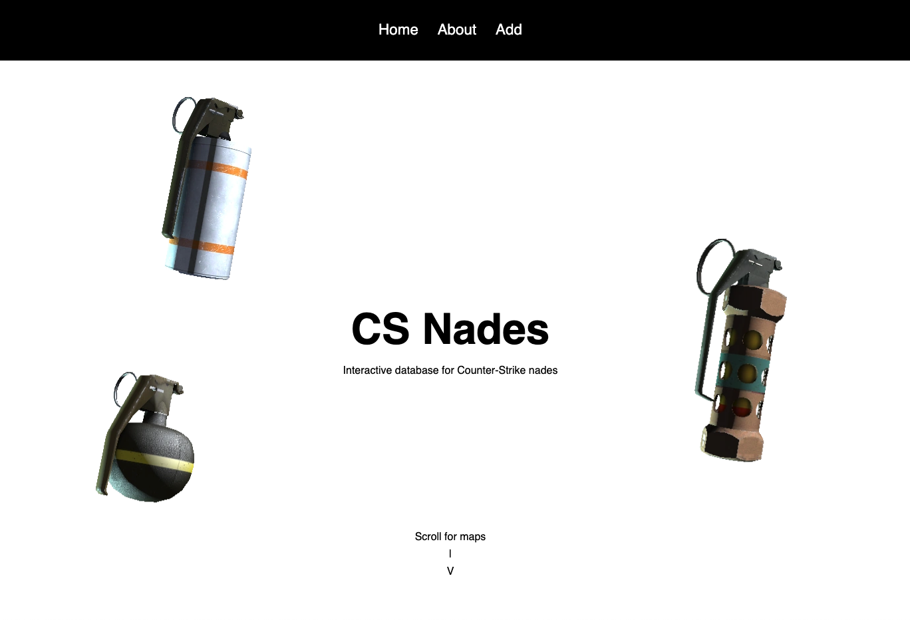

# CS2 Nades
### CS2 Nades is an interactive database of 100+ nades for Valve's first person shooter <a href="https://www.counter-strike.net/cs2">Counter-Strike 2</a>.
### It is a personal project sparked by a curiosity of how <a href="https://www.csgonades.com/">CSNades</a> is implemented.
### CS2 Nades...

# Usage
### ADD GIF LATER

# Tech Stack
### 
### CS2 Nades utilizes a MERN tech-stack consisting of:
- <a href="https://www.mongodb.com/">MongoDB</a>
- <a href="https://expressjs.com/">ExpressJS</a>
- <a href="https://react.dev/">ReactJS</a>
- <a href="https://nodejs.org/en">NodeJS</a>

# Additional Resources
### Additional Resources Include:
- <a href="https://react-leaflet.js.org/">React Leaflet</a>
- <a href="https://github.com/bramus/photoshop-google-maps-tile-cutter/">PS_Bramus.GoogleMapsTileCutter</a>
- <a href="https://www.typescriptlang.org/">TypeScript</a>
- <a href="https://vitejs.dev/">ViteJS</a>

# Future Updates
### As of January I have no intention of updating the website since <a href="https://www.csgonades.com/">CSNades</a> already exists.
### I was simply interested in how to implement such a project and to learn, goals that I feel I have successfully accomplished.